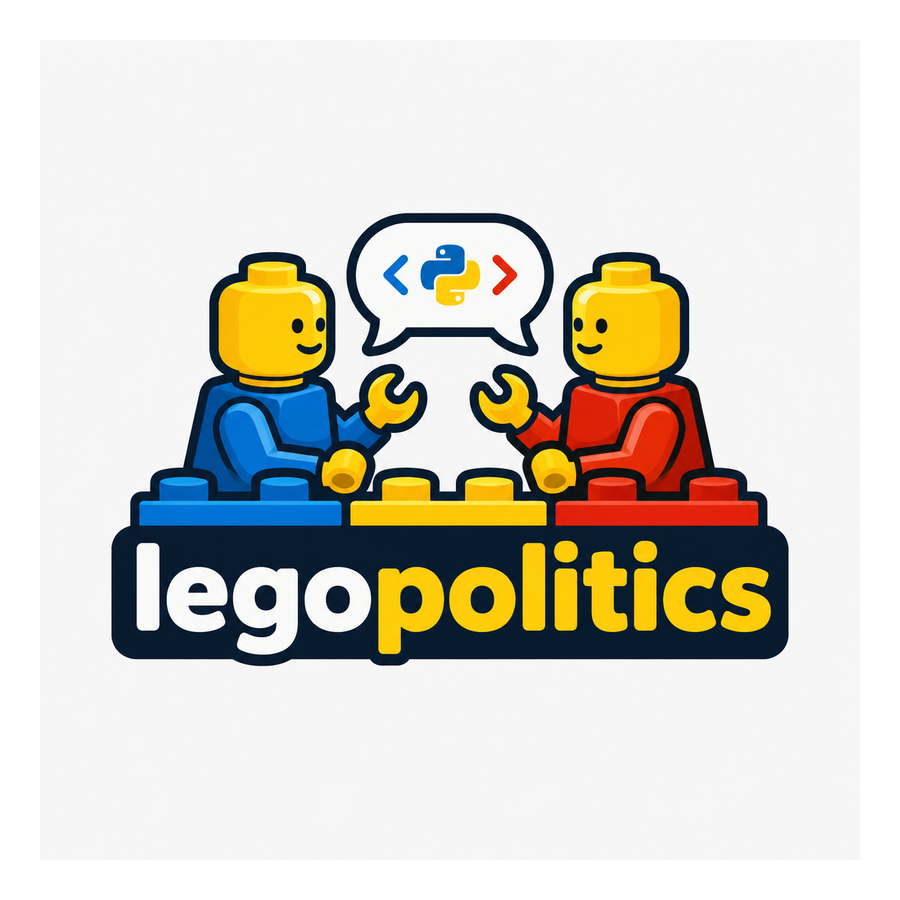

# legopolitics

{ width="420" }

**legopolitics** is a multimodal Python research package for converting political brick-built videos into structured, reproducible data.

It is designed for projects that need to connect what appears in a video with how characters and groups are portrayed over time. The package can combine object detection, tracking, image-language models, OCR, transcription, audio events, narrative segmentation, political codebooks, model agreement, and human validation.

> **Trademark notice:** LEGO® is a trademark of the LEGO Group of companies, which does not sponsor, authorize, or endorse this project. legopolitics is an independent academic research software project and is not affiliated with, maintained by, sponsored by, authorized by, or associated with the LEGO Group.

## What the package measures

- **Visual content:** figures, weapons, vehicles, flags, symbols, buildings, text, and other researcher-defined objects.
- **Character persistence:** which detections appear to represent the same figure across time.
- **Composition and prominence:** screen area, centrality, foreground position, visibility, contrast, and duration.
- **Actions and relationships:** who appears to act, defend, threaten, capture, protect, help, or flee.
- **Language and sound:** subtitles, speech bubbles, narration, translation, speaker turns, music, and audio events.
- **Narrative structure:** threat, victimization, attack, counterattack, rescue, victory, mourning, and calls to action.
- **Political representation:** agency, heroism, aggression, legitimacy, competence, affect, and delegitimization.
- **Reliability:** raw model outputs, voting, disagreement, validation samples, manual corrections, and human agreement.

## Pipeline

```text
video
  ├── metadata, scenes, audio, and sampling
  ├── frames and frame-quality measurements
  ├── closed-set and open-vocabulary detections
  ├── crops, masks, tracks, and re-identification
  ├── visual descriptions, OCR, transcript, and sound
  ├── relationships, temporal events, and narrative segments
  ├── political codebook measurements and contradiction checks
  └── Excel, Parquet, JSONL, SQLite, HTML, and validation outputs
```

## Start here

1. Read the [installation guide](installation.md).
2. Follow the [complete tutorial](tutorial.md).
3. Adapt the [configuration](configuration.md) and [political codebook](political_codebook.md).
4. Review the [methodology](methodology.md), [ethical considerations](ethical_considerations.md), and [limitations](limitations.md).

## Lightweight core, optional models

The base installation supports video discovery, probing, sampling, quality analysis, deterministic composition measurements, manifests, and exports. Heavy detector, VLM, OCR, diarization, and audio packages are optional and imported only when enabled.
